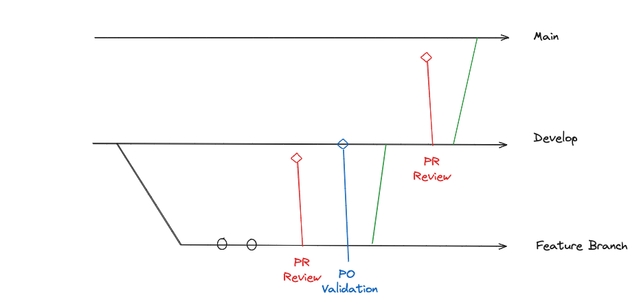

## lillinker App Frontend

## Table of Contents

- [Lillinker](#Lillinker)
  - [Installation](#installation)
    - [Minimum requirements](#minimum-requirements)
    - [Install the application locally](#install-the-application-locally)
- [Development](#development)
  - [Git workflow](#git-workflow)
  - [Coding conventions](#coding-conventions)
- [Architectures](#architectures)
  - [Frontend architecture](#frontend-architecture)

## Lillinker


💡 **Lillinker :** Locate. Link. Launch. 🚀

Lillinker addresses the challenges faced by independent workers when searching for a suitable umbrella company. The platform aims to make this process transparent and informative by connecting independents with multiple umbrella companies through a single channel. This enables them to receive multiple simulations and proposals in one place, while also providing the opportunity to explore the experiences and reviews of other independents who have worked with these companies.

✨ What the Platform Offers

💼 Multiple Options, One Channel: Simplify your search for umbrella companies by receiving simulations and proposals from multiple companies through the platform.

📊 Total Transparency: Compare offers with clear information on management fees and the reputation of each umbrella company.

🌐 Engaged Community: Join a community of passionate independent workers to share advice and experiences.

🗣️ Reviews and Experiences: Discover testimonials and reviews from other independents to make informed decisions.

🛠️ Optimization Tools: Maximize your success with resources and professional optimization tools available on the platform.

The platform aims to provide a user-friendly and transparent experience, allowing independent workers to navigate easily through the process of searching and selecting umbrella companies, while benefiting from a collaborative community and useful tools for their professional development.

## Installation

### Minimum requirements

- [NodeJS](https://nodejs.org/en/) (You can use [nvm](https://github.com/nvm-sh/nvm))
- [pnpm](https://pnpm.io/fr/installation)

The version requirements are listed in `engines` key of the [package.json file](package.json).

### Install the application locally

- Run `git clone git@github.com:Mkhalled/app-lillinker-frontend.git` to clone the repository
- Run `cd app-lillinker-frontend` to navigate to the code folder
- Run `pnpm` to install node dependencies
- Run `cp .env.example .env` to create the required environment variables.
- Run `pnpm run dev` to start the application on the 3000 port

## Development

### Git workflow

Commits should be formatted using the [Conventional Commits](https://www.conventionalcommits.org/en/v1.0.0/) convention.

- **build:** Changes that affect the build system or external dependencies (example scopes: gulp, broccoli, npm)
- **ci:** Changes to our CI configuration files and scripts (example scopes: Travis, Circle, BrowserStack, SauceLabs)
- **docs:** Documentation only changes
- **feat:** A new feature
- **fix:** A bug fix
- **perf:** A code change that improves performance
- **refactor:** A code change that neither fixes a bug nor adds a feature
- **style:** Changes that do not affect the meaning of the code (white-space, formatting, missing semi-colons, etc)
- **test:** Adding missing tests or correcting existing tests

```json
// config-conventional

module.exports = {
    extends: ['@commitlint/config-conventional'],
    rules: {
      'body-leading-blank': [1, 'always'],
      'body-max-line-length': [2, 'always', 100],
      'footer-leading-blank': [1, 'always'],
      'footer-max-line-length': [2, 'always', 100],
      'header-max-length': [2, 'always', 100],
      'scope-case': [2, 'always', 'lower-case'],
      'subject-case': [
        2,
        'never',
        ['sentence-case', 'start-case', 'pascal-case', 'upper-case'],
      ],
      'subject-empty': [2, 'never'],
      'subject-full-stop': [2, 'never', '.'],
      'type-case': [2, 'always', 'lower-case'],
      'type-empty': [2, 'never'],
      'type-enum': [
        2,
        'always',
        [
          'build',
          'chore',
          'ci',
          'docs',
          'feat',
          'fix',
          'perf',
          'refactor',
          'revert',
          'style',
          'test',
          'translation',
          'security',
          'changeset',
        ],
      ],
    },
  };
```

The project has 2 main branches:

- dev
- main

Each of them is synchronised with the corresponding environment (See [Continuous Delivery](#continuous-delivery) for more details).

The project uses the following git flow:



When starting a new feature, create a new branch `feature/short-description-of-the-feature` from the `dev` branch. When development is over, open a pull request on `dev` branch and ask other developers to review the code. When the code review is done, your branch can then be merged (manually or with a pull request) into `dev` branch for validation purpose. Note that merging into `dev`, `Main` will build and deploy automatically. Nothing more than merging is needed to deploy the frontend. When the feature is approved by the PO in `dev`, it's possible to merge the pull request in `Main` to deploy in production.

### Coding conventions

The coding conventions and style are enforced by the [eslint](https://eslint.org) linter, the [prettier](https://prettier.io/) formatter. The configuration can be found in the [.eslintrc](./.eslintrc.json) file, and the [.prettierrc](./.prettierrc) file. Your IDE should be configured to use those configurations.

To check linting error in command line, run `pnpm lint`.

To fix automatically format errors, run respectively `pnpm lint:fix`.

Additional conventions and practices can be found on [this Notion doc](https://www.notion.so/Docs-4ed395b2bea54ea8b6c593c46462e016).

## Architectures

### Lillinker Project Architecture

The global lillinker architecture schema is available on [Notion.so](https://www.notion.so/Docs-4ed395b2bea54ea8b6c593c46462e016).

### Frontend architecture
